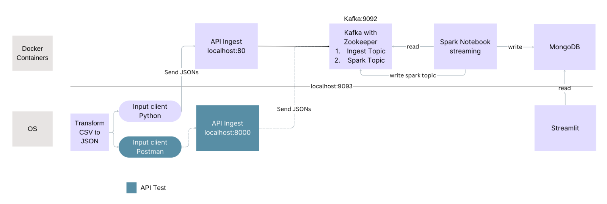

# Document Streaming Pipeline

In this project we are building scalable end-to-end solution that captures e-commerce data  about bought items, invoices and customers, transforms it, process it , writes it to db and generates insightful visualisations. 

### Design 

Project high-level design: 

### Data 

For this project I used random sample of 10.000 entries about online retail transactions. Each transaction contains following info: invoice no., stock code, description, quantity, invoice date, unit price, customer id and coutry. Data is taken from e-commerce dataset on [Kaggle](https://www.kaggle.com/datasets/carrie1/ecommerce-data). 

### Used Tools 

* Data cleanup, csv to json transformation: Python, pandas
* API creation: FastAPI
* API Test: Postman 
* Message streaming: Apache Kafka 
* Applications containerized with Docker
* Reading from kafka and writing to db: pyspark jupyter notebook
* Document storage: Mongodb 
* Dashboard: streamlit 

WIP 